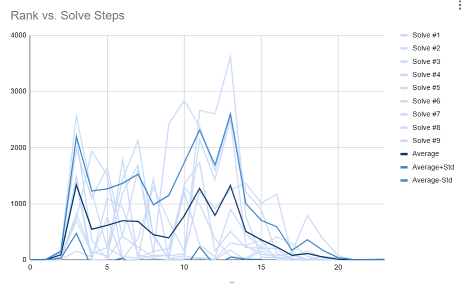

# CubeGPT: A Transformer-based Rubik's Cube Solver

This project is inspired by the CayleyPy, EfficientCube, and DeepCubeA papers. It is also, very vaguely, inspired by chess engines.

### Sections
[Problem](#problem)
  [Approach](#approach)
  [Results](#results)
  [More Solve Videos](#more-solves)

## Problem
### The 3x3 Rubik's Cube
The Rubik's Cube presents an interesting challenge for search algorithms. With roughly 4 * 1019 possible states but only one destination, traditional algorithms that tend to explore a large fraction of state space (like breadth first search, or even A*) are not practically applicable. I have to prune the decision trees *extremely* aggressively if I want to solve Cubes in a realistic amount of time (and using a minimal number of moves to do so). This begs a highly effective heuristic function, which is where machine learning comes in. In this project I investigate whether transformer neural networks can be used to effectively and efficiently solve Rubik's Cubes.

### Did it work?

My method proves quite effective. For instance, the solver finds the following 19-move solution to the Cube in the above graphic:

https://github.com/user-attachments/assets/99eee76e-5053-4918-a314-cbfdbe08be9d

Image/video rendered using py-renderer, a 3D renderer I built to visualize this project.

## Approach

### Neural Network
I train a transformer neural network to predict the number of moves required to solve a Rubik's Cube, a sense of 'distance' from the solved state. This neural network will serve as my heuristic function. 

Technical details: Cubes are tokenized by each piece, or 'cubelet'. A token representing the piece's identity (20 possibilities, treating center pieces as unmovable) and its location and orientation (48 possibilities) are added together. The models are given an additional output token. Regression output is extracted by taking the final value of the output token and feeding it through a linear layer. The hyperparameters were selected by experimental performance after being trained on 3.84M examples. I settled on 256 embed dimension, 16 heads per layer, 512 feedforward dimension, and 8 layers. For CubeGPT-2h I used ReLU activation and for CubeGPT-2g I used GeLU activation. Training was done with the Adam optimizer set with learning rate 0.0001 and halved whenever training loss stagnated for 3,000 consecutive batches. Finetuning and later training were generally done with the same settings but a 10x-100x lower starting learning rate.

### Training
Training data is generated by taking random walks from the starting state, with some optimizations to help prevent backtracking. The random walk distance serves as an estimator for the true distance from the solved state. Since shorter paths are more likely to hit any given state than longer paths (because longer paths may access many more states), theoretically the minimum length path will dominate.

### Path Finetuning
I experiment with a method I call "Path Finetuning." I train first on individual random samples (the 'ends' of the random walks) then finetune on entire random walks. I empirically show this typically improves loss and accuracy metrics, even where normal training with more data failed to produce or produced lesser improvements. 

That being said, more testing has to be done in the case where the model has been trained on much more data than typical, as in CubeGPT-CLS-51m and -t25m models.

### Solving

Solving is done via beam search: every step, I project forward one move, then evaluate each of those new states using the model. All but the lowest *w* are pruned. For solving fully scrambled cubes, I find highly consistent success with *w* = 4000. Increasing *w* generally increases the solve probability and decreases the lengths of the found solutions. 

## Results

### Solver Results

Setting the beam width *w* = 4000, the transformer model is able to highly consistently solve fully scrambled Rubik's Cubes. And with only *w* = 300, we were able to achieve a fully optimal depth-10 solver.

| Scramble Depth | *w* | Solve Probability | Average Solve Length (Moves, HTM metric) |
| -------------- | --- | ----------------- | ---------------------------------------- |
| 10             | 100 | 98%               | N/A                                      |
| 10             | 200 | 99%               | N/A                                      |
| 10             | 300 | 100%              | 10.0                                     |
| 15             | 200 | 58%               | N/A                                      |
| 15             | 300 | 62%               | 21.6                                     |
| 15             | 500 | 78%               | 21.5                                     |
| 15             | 1000| 89%               | 19.7                                     |
| Full (30)      | 4000| 100%              | 21.1                                     |

For comparison purposes, elite human solvers typically take 50 to 60 moves to solve a fully scrambled cube. Those optimizing for lower move counts typically lie in the 40 to 50 range. Theoretically, no Cube takes more than 20 optimal moves to solve, and the average Cube takes roughly 17.7. Therefore, an average of 21.1 approaches the theoretical optimal.    

### Model Results
For this project, a number of models were trained and evaluated. We can see that path finetuning increases the efficiency of training data (compare 2h-PFT and 2g, even when 2g has a better activation function and more training) but that adding more data also leads to overall significant improvements (see -t51m). Solver results were mostly obtained with 2g-PFT. Solve testing is yet to be done with the best model, CLS-t51m.

| Model             | Training Examples (Millions) | Mean Squared Error | Within-3-Accuracy | Within-4-Accuracy | Accuracy (When rounding to nearest int) |
| ---               | ---                          | ---                | ---               | ---               | ---                                     |
|CubeGPT 2h-mix     | 3.84                         | 5.58               | N/A               | N/A               | N/A                                     |
|CubeGPT 2h-early   | 3.84                         | 5.02               | N/A               | N/A               | N/A                                     |
|CubeGPT 2h         | 7.68                         | 4.96               | 81.41%            | 90.71%            | 37.51%                                  |
|CubeGPT 2h-PFT     | 12.9                         | 4.87               | 81.49%            | 90.94%            | 38.06%                                  |
|CubeGPT 2g-early   | 7.68                         | 4.86               | N/A               | N/A               | N/A                                     |
|CubeGPT 2g         | 15.4                         | 4.68               | 81.93%            | 91.23%            | 37.85%                                  |
|CubeGPT 2g-PFT     | 26.2                         | 4.70               | 82.49%            | 91.37%            | 37.88%                                  |
|CubeGPT-CLS-t51m (mode)|51.2                      | 7.12               | 74.38%            | 82.24             | **45.17%**                              |
|CubeGPT-CLS-t51m (avg)| 51.2                      |**4.33**            |**83.53%**         | **92.15%**        | 42.27%                                  |

  **CubeGPT 2h**: Consider this the 'default' or base model, uses basic transformer architecture and ReLU activation. 
  **CubeGPT 2h-mix**: Same architecture as 2h, but trained on both full paths and individual samples. Shows that prematurely training on paths gives worse results. 
  **CubeGPT 2h-early**: A snapshot of CubeGPT-2h halfway through training.
  **CubeGPT 2h-PFT**: 2h after Path Finetuning. (Named as -2h-morepft in models/)
  **CubeGPT 2g**: Same architecture as 2h, but using GeLU instead of ReLU. (Named as -2g-t2 in models/)
  **CubeGPT 2g-early**: 2g snapshot during training. (Named as -2g in models/)
  **CubeGPT 2g-PFT**: 2g after Path Finetuning. (Named as -2g-tmpft2 in models/)
  **CubeGPT-CLS-t51m**: Classifier model with same architecture as 2g but a classifier head at the end, trained on mountains more data than any other. Since it predicts a whole probability distribution, evaluation was done on both the average and modes, represented by the (avg) and (mode) tags. 
### Tracking Solutions

In the process of beam search, the program sorts all of the potential states by their model evaluation. I can therefore go through the history of the beam search throughout solving and track the specific path that the solution took through the rankings. Shown is this analysis on a selection of 9 beam search histories.  

Note that the first 4 steps are not sorted, so these ranks are effectively random (because no eliminations would be done anyway, so we can save the time of computing the model evaluation). We can see that the model ranks the found solution at roughly 500-1000 for most of the first 15 steps, then this quickly drops to very low values as the end of the solution is approached. Perhaps in future work an alternative to beam search could be implemented to exploit the relatively predictable nature of these paths. 
## More Solves

https://github.com/user-attachments/assets/37efc5e2-a912-47d4-a3f1-33cf9cbca75c

https://github.com/user-attachments/assets/8c89c2d3-0b6d-4598-9951-6ff9c6129f9a

