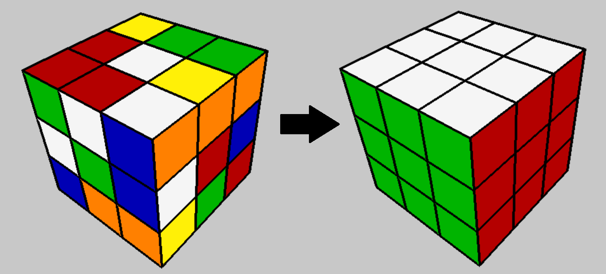

# CubeGPT: A Transformer-based Rubik's Cube Solver

## Problem: The 3x3 Rubik's Cube
The Rubik's Cube presents an interesting challenge for search algorithms. With roughly 4 * 1019 possible states but only one destination, traditional algorithms that tend to explore a large fraction of state space (like breadth first search, or even A*) are not practically applicable. We have to prune our decision trees *extremely* aggressively if we want to solve Cubes in a realistic amount of time and with a minimal number of moves. This begs a highly effective heuristic function, which is where machine learning comes in. 

Our method proved effective. For instance, our solve found the following 19-move solution to the Cube in the above graphic:

https://github.com/user-attachments/assets/99eee76e-5053-4918-a314-cbfdbe08be9d

This project is inspired by the CayleyPy, EfficientCube, and DeepCubeA papers.

Images rendered using py-renderer, which I also made!

## Approach

### Neural Network
We train a transformer neural network to predict the number of moves required to solve a Rubik's Cube, a sense of 'distance' from the solved state. This neural network will serve as our heuristic function. 

Technical details: The hyperparameters were selected by experimental performance after being trained on 3.84M examples. We settled on 256 embed dimension, 16 heads per layer, 512 feedforward dimension, and 8 layers. For CubeGPT-2h we used ReLU activation and for CubeGPT-2g we used GeLU activation. Training was done with the Adam optimizer set with learning rate 0.0001 and halved whenever training loss stagnated for 3,000 consecutive batches. Finetuning and later training were generally done with the same settings but a 10x-100x lower starting learning rate.

### Training
Training data is generated by taking random walks from the starting state, with some optimizations to help prevent backtracking. The random walk distance serves as an estimator for the true distance from the solved state. Since shorter paths are more likely to hit any given state than longer paths (because longer paths may access many more states), theoretically the minimum length path will dominate.

We empirically show that training first on individual random samples (the 'ends' of the random walks) then finetuning on entire random walks allows these models to achieve minimum loss and typically maximum accuracy metrics. I refer to this method as "Path Finetuning."

### Solving

Solving is done via beam search: every step, we project forward one move, then evaluate each of those new states using the model. All but the lowest *w* are pruned. For solving fully scrambled cubes, we find highly consistent success with *w* = 4000. Increasing *w* generally increases the solve probability and decreases the lengths of the found solutions. 

## Results

### Solver Results

Setting the beam width *w* = 4000, our transformer model is able to highly consistently solve fully scrambled Rubik's Cubes. Tests were conducted with sample size 100. Tests were cut off and marked failed if a solution was not found after 50 moves. 

| Scramble Depth | *w* | Solve Probability | Average Solve Length (Moves, HTM metric) |
| -------------- | --- | ----------------- | ---------------------------------------- |
| 10             | 100 | 98%               | N/A                                      |
| 10             | 200 | 99%               | N/A                                      |
| 15             | 200 | 58%               | N/A                                      |
| Full (30)      | 4000| 100%              | 21.1                                     |

For comparison purposes, elite human solvers typically take 50 to 60 moves to solve a fully scrambled cube. Those optimizing for lower move counts typically lie in the 40 to 50 range. The theoretical maximum is 20, and using optimal solvers it is found that in practice most take around 18. Therefore, an average of 21.1 approaches the theoretical optimal.    

### Model Results
For this project, a number of models were trained and evaluated. Selected results are shown.

| Model             | Training Examples (Millions) | Mean Squared Error | Within-3-Accuracy | Within-4-Accuracy | Accuracy (When rounding to nearest int) |
| ---               | ---                          | ---                | ---               | ---               | ---                                     |
|CubeGPT 2h-early   | 3.84                         | 5.02               | N/A               | N/A               | N/A                                     |
|CubeGPT 2h         | 7.68                         | 4.96               | 81.41%            | 90.71%            | 37.51%                                  |
|CubeGPT 2h-PFT     | 12.9                         | 4.87               | 81.49%            | 90.94%            |**38.06%**                               |
|CubeGPT 2g-early   | 7.68                         | 4.86               | N/A               | N/A               | N/A                                     |
|CubeGPT 2g         | 15.4                         |**4.68**            |  81.93%           | 91.23%            | 37.85%                                  |
|CubeGPT 2g-PFT     | 26.2                         |  4.70              |**82.49%**         | **91.37%**        | 37.88%                                  |

  **CubeGPT 2h**: Consider this the 'default' or base model, uses basic transformer architecture and ReLU activation. 
  **CubeGPT 2h-early**: A snapshot of CubeGPT-2h halfway through training.
  **CubeGPT 2h-PFT**: 2h after Path Finetuning. (Named as -2h-morepft in models/)
  **CubeGPT 2g**: Same architecture as 2h, but using GeLU instead of ReLU. (Named as -2g-t2 in models/)
  **CubeGPT 2g-early**: 2g snapshot during training. (Named as -2g in models/)
  **CubeGPT 2g-PFT**: 2g after Path Finetuning. (Named as -2g-tmpft2 in models/)

